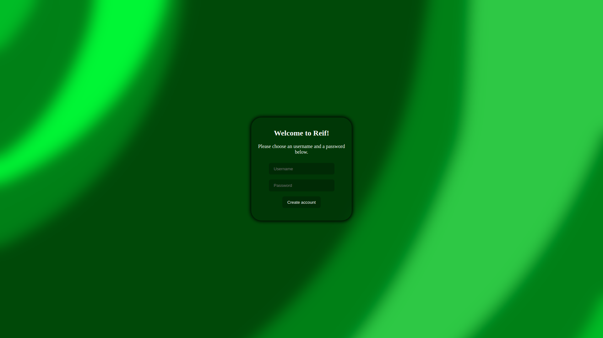

# Website

This repo will contain the source code of Reif itself, the website managment system of Reifenberg. It can be used by anyone, feature requests are also accepted, but feature requests by Reifenberg will be done before others. Please do not create PRs/issues until v0.0.1 is released.
## Versions

| Name | In development | Alpha | Beta | stable |
|------|----------------|-------|------|-------|
Logo |  |  |  |  |
Description | The latest version. Contains features still in development, and they may be unfinished. Has many bugs. | The version with all finished, but not tested features. Has many bugs, but less than In development. | The version with all finished, but not fully tested features yet. Features here have been tested in Alpha. Contains some bugs. | Well-tested features, doesn't contain any known bugs. |
